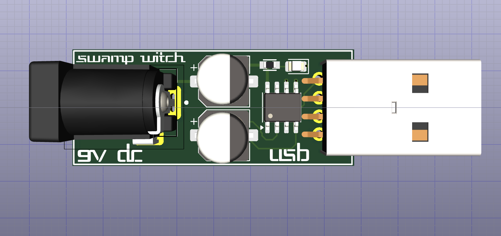
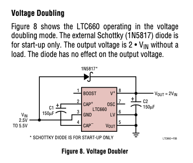

# USB POWER

Have you ever needed to power a guitar pedal at your desk? What about on the go? Maybe you're away from your board and you just want to test something out, but you've got no power bank.

Enter the USB power converter. This USB-A plugin device provides a 9V(ish) power source to a [standard DC power jack](https://www.sparkfun.com/products/119) so that you can power a pedal in any situation.

## Project Details
Includes a zip file of gerber data for the PCB, as well as BOM and Pick'n'Place files for JLCPCB. [All files found here]().

## Technical Details
The chip on this board is the [LTC660](https://www.analog.com/media/en/technical-documentation/data-sheets/660fa.pdf), a low-power CMOS charge pump that can provide up to 100mA of current. The basic schematic is taken from the datasheet 

